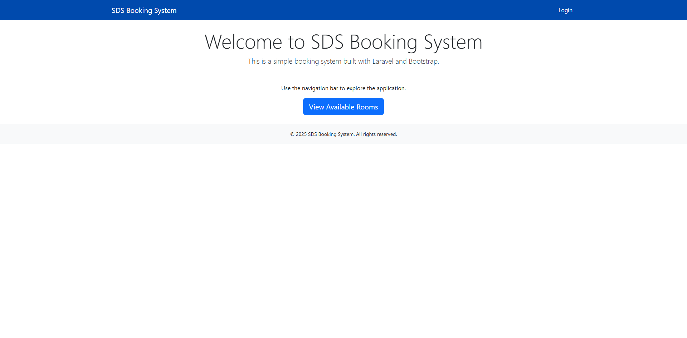
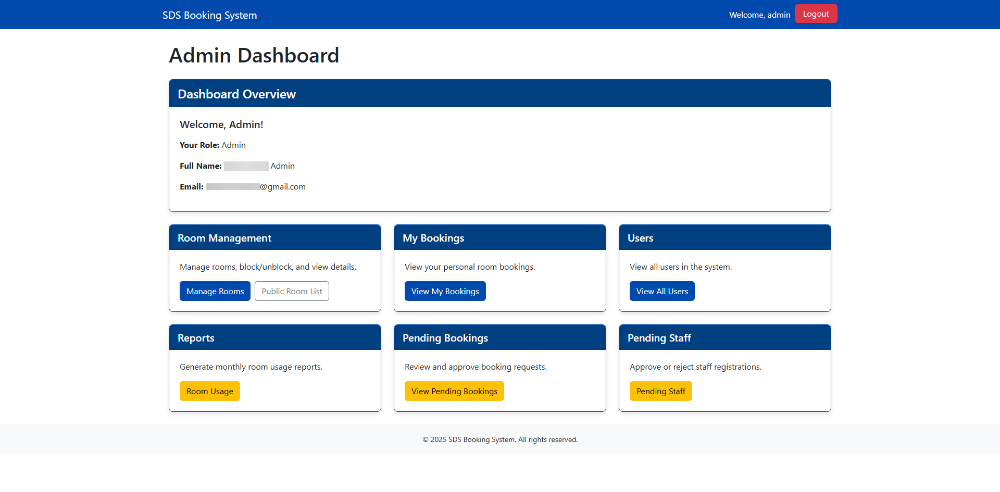
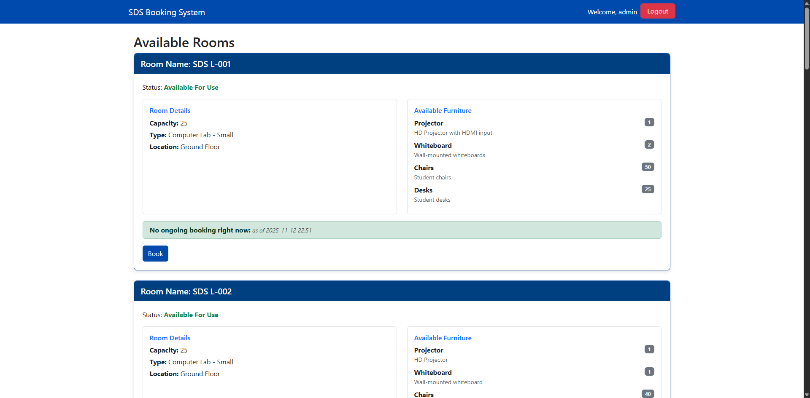

# Room Booking Application

This project is developed as part of **ZC-4302 Internet Application Development — Assignment 1**.  
The task is to build a simplified version of a real-world room booking system using **Laravel 12** and any suitable Laravel packages.

---

## Table of Contents

-   [Overview](#overview)
-   [Application Requirements](#application-requirements)
-   [Extended Application Requirements](#extended-application-requirements)
-   [Screenshots](#screenshots)
-   [License](#license)

---

## Overview

The goal of this application is to provide a functional room booking system that allows authenticated users to reserve rooms while enforcing booking rules.  
The system will be extended with features such as role-based permissions, booking workflows, notifications, and reports.

---

## Application Requirements

### **Completed Requirements**

-   [x] **User Authentication**

    -   [x] Only authenticated users can make a booking.

-   [x] **Room Capacity Constraint**

    -   [x] A user cannot book a high-capacity room if their group size is less than half the room’s capacity.

-   [x] **Single Booking Rule**

    -   [x] A user cannot book more than one room for the same date and time slot.
    -   [x] Time slots should align with the UBD timetable schedule.

-   [x] **Room Availability Constraint**

    -   [x] A room cannot be booked by more than one user for the same date and time slot.

-   [x] **Conflict Detection**

    -   [x] The application must detect and prevent any conflicting conditions based on the rules above.

-   [x] **User Roles and Permissions**

    -   [x] The system must support different user roles (e.g., student, lecturer, admin), each with specific access rights.
    -   [x] Only lecturers and admins can book certain specialized rooms.

-   [x] **Booking Approval Workflow**

    -   Certain room bookings (e.g., special events or large rooms) must go through an approval process by an admin or department head.

-   [x] **Email Notifications**

    -   [x] The system should send email confirmations to users after a successful booking, including details like room, date, time slot, and booking status.
    -   [x] Notifications must also be sent for cancellations or changes.

-   [x] **Booking Cancellation and Modification**

    -   [x] Users should be able to cancel or modify bookings within a specified time frame (e.g., at least 24 hours before the scheduled time).

-   [ ] **Room Features and Equipment**

    -   [x] Each room should have metadata such as projector, whiteboard, and number of sockets.

-   [x] **Usage Reports and Logs**

    -   [x] Admin users should be able to generate reports on room usage, including frequency, user statistics, and peak times.

-   [x] **Booking Limits**

    -   [x] Users should be restricted to a maximum number of bookings per week (e.g., 3 active bookings at a time) to prevent misuse of the system.

-   [x] **Room Maintenance and Blackout Periods**
    -   [x] Admins must be able to block certain rooms for maintenance or special events.
    -   [x] During these periods, no bookings can be made.

### **Incomplete Requirements**

-   [ ] **Room Availability Calendar**

    -   [ ] Users should be able to view a calendar or timetable interface showing room availability before making a booking.

-   [ ] **Room Features and Equipment**

    -   [ ] Users must be able to filter and request rooms based on these features.

-   [ ] **Recurring Bookings**

    -   [ ] The system should allow recurring bookings (e.g., weekly classes) for lecturers or admin users.
    -   [ ] Conflict-checking must apply for all dates in the series.

## **Archived**

<strong>Core Requirements</strong>

-   [x] **User Authentication**

    -   [x] Only authenticated users can make a booking.

-   [x] **Room Capacity Constraint**

    -   [x] A user cannot book a high-capacity room if their group size is less than half the room’s capacity.

-   [x] **Single Booking Rule**

    -   [x] A user cannot book more than one room for the same date and time slot.
    -   [x] Time slots should align with the UBD timetable schedule.

-   [x] **Room Availability Constraint**

    -   [x] A room cannot be booked by more than one user for the same date and time slot.

-   [x] **Conflict Detection**
    -   [x] The application must detect and prevent any conflicting conditions based on the rules above.

---

<strong>Extended Requirements</strong>

-   [x] **User Roles and Permissions**

    -   [x] The system must support different user roles (e.g., student, lecturer, admin), each with specific access rights.
    -   [x] Only lecturers and admins can book certain specialized rooms.

-   [ ] **Room Availability Calendar**

    -   [ ] Users should be able to view a calendar or timetable interface showing room availability before making a booking.

-   [x] **Booking Approval Workflow**

    -   Certain room bookings (e.g., special events or large rooms) must go through an approval process by an admin or department head.

-   [x] **Email Notifications**

    -   [x] The system should send email confirmations to users after a successful booking, including details like room, date, time slot, and booking status.
    -   [x] Notifications must also be sent for cancellations or changes.

-   [x] **Booking Cancellation and Modification**

    -   [x] Users should be able to cancel or modify bookings within a specified time frame (e.g., at least 24 hours before the scheduled time).

-   [ ] **Room Features and Equipment**

    -   [x] Each room should have metadata such as projector, whiteboard, and number of sockets.
    -   [ ] Users must be able to filter and request rooms based on these features.

-   [x] **Usage Reports and Logs**

    -   [x] Admin users should be able to generate reports on room usage, including frequency, user statistics, and peak times.

-   [ ] **Recurring Bookings**

    -   [ ] The system should allow recurring bookings (e.g., weekly classes) for lecturers or admin users.
    -   [ ] Conflict-checking must apply for all dates in the series.

-   [x] **Booking Limits**

    -   [x] Users should be restricted to a maximum number of bookings per week (e.g., 3 active bookings at a time) to prevent misuse of the system.

-   [x] **Room Maintenance and Blackout Periods**
    -   [x] Admins must be able to block certain rooms for maintenance or special events.
    -   [x] During these periods, no bookings can be made.

## Screenshots

_Add screenshots of the UI once implemented._

---

## License

_This project is for academic purposes under ZC-4302 Internet Application Development. License details can be added here._
